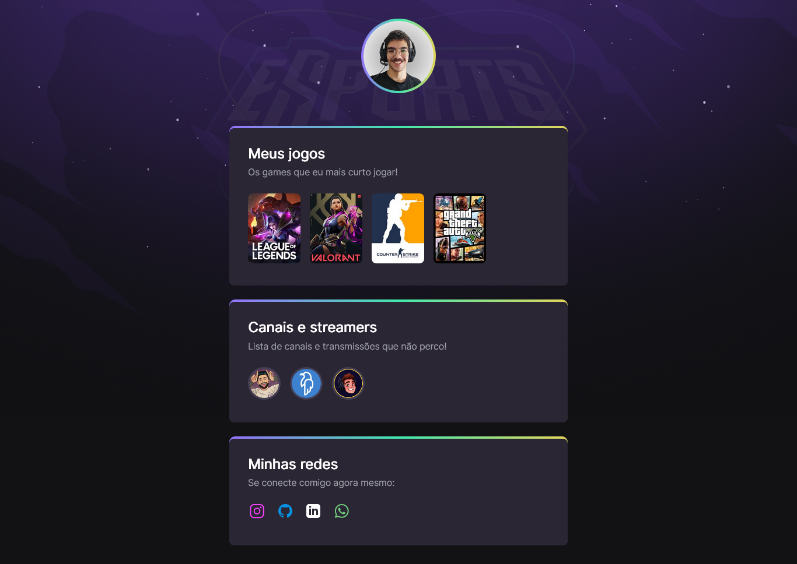

# NLW eSports

>Trilha Explorer

Projeto contruído no evento Next Level Week da Rocketseat.

[🔗 Clique aqui para acessar](https://joao2arj.github.io/nlw)

## 🛠️ Tecnologias

- HTML
- CSS
- Git e Github

## 🔵 Informações adicionais
O projeto teve como foco os passos iniciais em HTML, CSS e Git, onde foram abordados tópicos como: keyframes, efeitos, delays, uso do Figma dentre outros.

## ✉️ Contato

- E-mail: joao2arj@gmail.com
- LinkedIn: linkedin.com/in/joao2arj